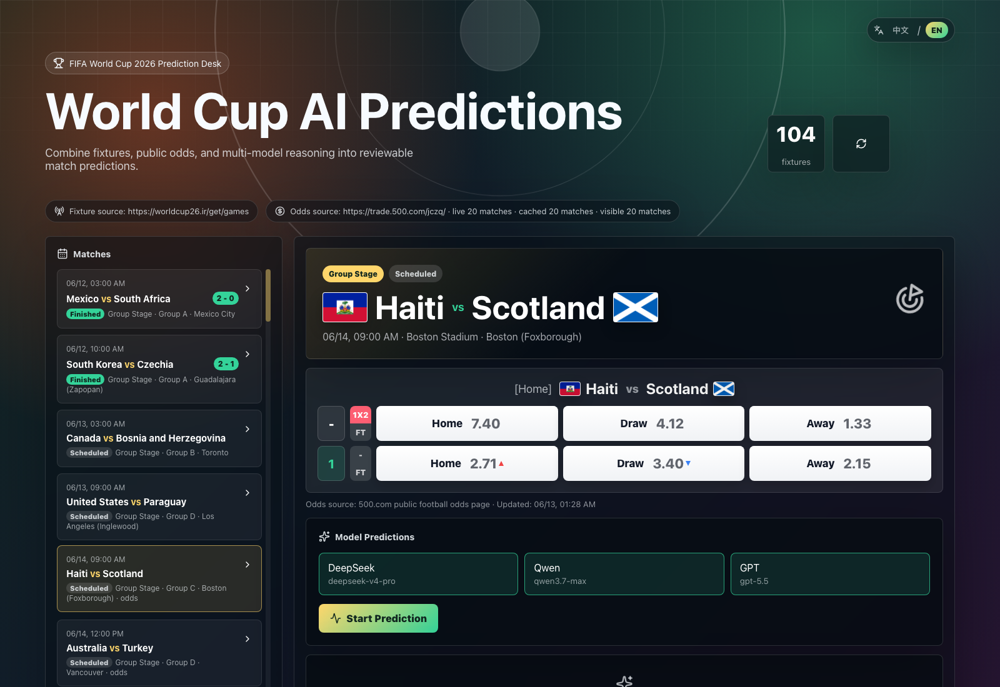

<div align="center">

# FIFA Predictions

**World Cup 2026 fixtures, public odds, and multi-model AI match predictions.**

[简体中文](README.md) | English

</div>

> **Disclaimer**: This project is for entertainment and learning only. It is not betting, investment, or decision-making advice. Fixtures, odds, and model predictions may be delayed, incomplete, or incorrect. Do not use them for betting or any financial activity. This project must not be used for illegal activity, regulatory evasion, fraud, money laundering, illegal gambling, or any activity that violates applicable laws and regulations. Odds scraping depends on public page structure and should be replaced with an authorized data provider for production use. Never commit real API keys.



## Features

- Ingests World Cup 2026 fixtures and displays match times in Beijing time
- Scrapes public football odds from `trade.500.com/jczq/`
- Persists odds cache so previously available odds are not overwritten by empty refreshes
- Supports DeepSeek, Qwen, and GPT provider slots via OpenAI-compatible APIs
- Runs all enabled models in parallel from the "开始预测" action
- Passes fixture data, odds, match status, scores, and web-search context into prediction prompts
- Caches per-match predictions until the user explicitly refreshes them
- World Cup themed dashboard with flags, match navigation, odds cards, and model analysis cards
- CLI for serving, data checks, predictions, and cache cleanup
- Codex Skill scaffold in `skills/fifa-predictions`

## Quick Start

Clone and install:

```bash
git clone https://github.com/FUTUREWORKER/fifa-predictions.git
cd fifa-predictions
npm install
```

Create your local provider config:

```bash
cp config/providers.example.json config/providers.json
```

Fill `config/providers.json` with your own `baseURL`, `apiKey`, and `model`, then start the app:

```bash
npm run dev
```

Open the web app:

```text
http://localhost:5173
```

API server:

```text
http://localhost:5174
```

## Configure Models

Edit `config/providers.json`:

```json
{
  "providers": [
    {
      "id": "deepseek",
      "name": "DeepSeek",
      "enabled": true,
      "baseURL": "https://api.deepseek.com",
      "apiKey": "YOUR_KEY",
      "model": "deepseek-chat"
    }
  ]
}
```

`config/providers.json` is ignored by git. Keep secrets local.

## Install As A CLI

Use from a cloned checkout:

```bash
npm link
fifa-predictions check-data
fifa-predictions serve
```

Or run directly with npm:

```bash
npm run cli -- check-data
npm run cli -- serve
```

## CLI

Run with npm:

```bash
npm run cli -- check-data
npm run cli -- predict --match 3 --provider all --force
npm run cli -- clear-cache all
npm run cli -- config
```

After global install or `npm link`:

```bash
fifa-predictions check-data
fifa-predictions serve
```

Commands:

- `serve`: start the local API and Vite web app
- `check-data`: verify fixture, odds, and cache counts
- `predict --match <id> --provider <all|deepseek|qwen|gpt> [--force]`: run model predictions
- `clear-cache [predictions|odds|all]`: remove local cache files
- `config`: print redacted provider configuration status

## Data Sources

Fixtures:

```json
{
  "schedule": {
    "type": "worldcup26",
    "url": "https://worldcup26.ir/get/games",
    "localFile": "data/schedule.seed.json",
    "timeoutMs": 10000
  }
}
```

Odds:

```json
{
  "odds": {
    "type": "sporttery-500",
    "url": "https://trade.500.com/jczq/",
    "localFile": "",
    "timeoutMs": 10000
  }
}
```

The odds scraper writes `data/odds-cache.json`. If a match disappears from the public page on a later refresh, the cached odds remain available.

## API

- `GET /api/health`
- `GET /api/config/status`
- `GET /api/matches`
- `GET /api/predictions/:matchId`
- `POST /api/predict`
- `POST /api/predict/all`

Single prediction request:

```json
{
  "matchId": "3",
  "providerId": "deepseek",
  "force": true
}
```

## Codex Skill

The repo includes a skill scaffold:

```text
skills/fifa-predictions/
```

Install it locally:

```bash
mkdir -p ~/.codex/skills
cp -R skills/fifa-predictions ~/.codex/skills/
```

Then ask Codex to use `$fifa-predictions`.

## Agent Support

This repository includes two agent-friendly entry points:

- `AGENTS.md`: portable project instructions for general coding agents that read repository guidance.
- `skills/fifa-predictions/`: a Codex Skill package for Codex environments that support Skills.

For agents that do not support Codex Skills, point them at `AGENTS.md` and ask them to follow the install, safety, data, and validation rules there.

## Development

```bash
npm run lint
npm run build
npm run cli -- check-data
```

## Security

- Do not commit `config/providers.json`
- Do not commit `.env` or `.env.local`
- Do not commit cache files containing private analysis context
- Use authorized sports and odds data providers for production
- This project is for entertainment and learning only; predictions are not betting, investment, or decision-making advice and must not be used for illegal activity or any activity that violates applicable laws and regulations

## License

MIT
