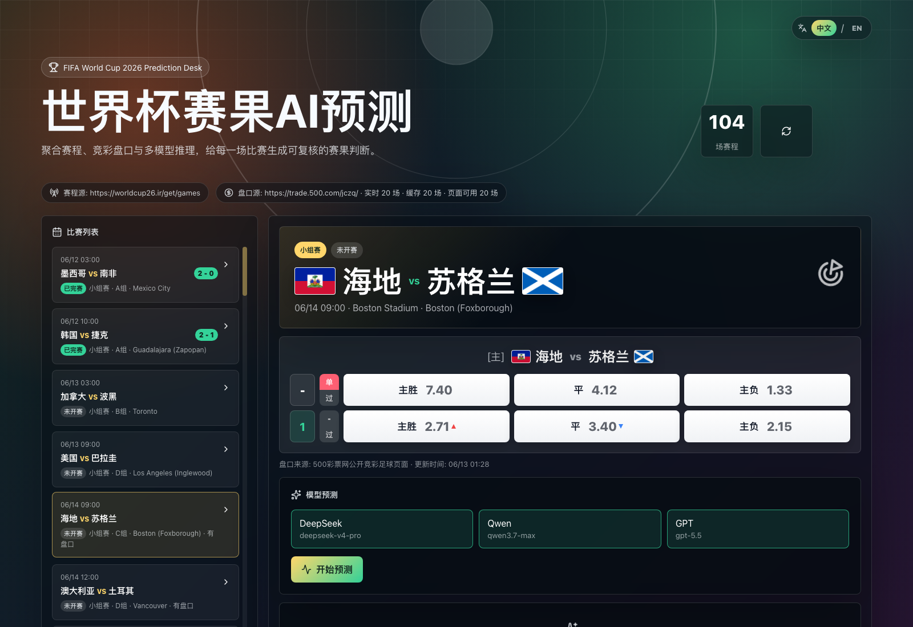

<div align="center">

# 世界杯赛果 AI 预测

**聚合 2026 世界杯赛程、公开盘口与多模型 AI 推理的本地预测工作台。**

简体中文 | [English](README.en.md)

</div>

> **免责声明**：本项目仅用于娱乐和学习，不构成任何投注、投资或决策建议。赛程、盘口与模型预测可能存在延迟、缺失或错误，请勿据此进行投注或其他资金相关行为。盘口抓取依赖公开网页结构，生产环境请替换为授权数据源。请勿将真实 API Key 提交到仓库。



## 功能特性

- 接入 2026 世界杯赛程数据，并统一展示为北京时间
- 抓取 500 彩票网公开竞彩足球盘口页面
- 盘口落盘缓存：如果刷新后某场盘口消失，会保留上一次有效盘口
- 支持 DeepSeek、Qwen、GPT 三个 OpenAI-compatible 模型配置位
- 点击“开始预测”后，三个模型并发预测
- 预测时拼接赛程、盘口、比赛状态、比分和联网搜索上下文
- 每场比赛预测结果会缓存，直到再次点击“开始预测”才刷新
- Web 页面包含世界杯视觉氛围、国旗、赛程列表、盘口卡片和模型分析卡
- CLI 支持启动服务、检查数据、发起预测和清理缓存
- 内置 Codex Skill 脚手架，方便结合 Codex/CLI 工作流

## 快速开始

克隆并安装：

```bash
git clone https://github.com/FUTUREWORKER/fifa-predictions.git
cd fifa-predictions
npm install
```

创建本地模型配置：

```bash
cp config/providers.example.json config/providers.json
```

在 `config/providers.json` 中填入你自己的 `baseURL`、`apiKey` 和 `model`，然后启动：

```bash
npm run dev
```

打开 Web 页面：

```text
http://localhost:5173
```

API 服务默认地址：

```text
http://localhost:5174
```

## 模型配置

编辑 `config/providers.json`：

```json
{
  "providers": [
    {
      "id": "deepseek",
      "name": "DeepSeek",
      "enabled": true,
      "baseURL": "https://api.deepseek.com",
      "apiKey": "YOUR_KEY",
      "model": "deepseek-chat"
    }
  ]
}
```

`config/providers.json` 已被 `.gitignore` 忽略，不会提交到 GitHub。真实 API Key 请只保存在本地。

## 作为 CLI 安装

在克隆后的项目目录中：

```bash
npm link
fifa-predictions check-data
fifa-predictions serve
```

也可以直接通过 npm 运行：

```bash
npm run cli -- check-data
npm run cli -- serve
```

## CLI 用法

通过 npm 运行：

```bash
npm run cli -- check-data
npm run cli -- predict --match 3 --provider all --force
npm run cli -- clear-cache all
npm run cli -- config
```

全局安装或 `npm link` 后：

```bash
fifa-predictions check-data
fifa-predictions serve
```

可用命令：

- `serve`：启动本地 API 和 Vite Web 页面
- `check-data`：检查赛程、盘口和缓存数量
- `predict --match <id> --provider <all|deepseek|qwen|gpt> [--force]`：运行模型预测
- `clear-cache [predictions|odds|all]`：清理本地缓存文件
- `config`：输出脱敏后的模型配置状态

## 数据源

赛程：

```json
{
  "schedule": {
    "type": "worldcup26",
    "url": "https://worldcup26.ir/get/games",
    "localFile": "data/schedule.seed.json",
    "timeoutMs": 10000
  }
}
```

盘口：

```json
{
  "odds": {
    "type": "sporttery-500",
    "url": "https://trade.500.com/jczq/",
    "localFile": "",
    "timeoutMs": 10000
  }
}
```

盘口缓存会写入 `data/odds-cache.json`。如果某场比赛在后续公开页面中不再出现，应用会继续使用上次缓存的盘口数据。

## API

- `GET /api/health`
- `GET /api/config/status`
- `GET /api/matches`
- `GET /api/predictions/:matchId`
- `POST /api/predict`
- `POST /api/predict/all`

单模型预测请求示例：

```json
{
  "matchId": "3",
  "providerId": "deepseek",
  "force": true
}
```

## Codex Skill

仓库内置 Skill 脚手架：

```text
skills/fifa-predictions/
```

安装到本地 Codex：

```bash
mkdir -p ~/.codex/skills
cp -R skills/fifa-predictions ~/.codex/skills/
```

之后可以让 Codex 使用 `$fifa-predictions` 处理赛程、盘口、预测和缓存相关工作。

## Agent 支持

仓库提供两个面向 Agent 的入口：

- `AGENTS.md`：通用编码 Agent 可读的项目说明，包含安装、安全、数据和校验规则。
- `skills/fifa-predictions/`：适用于支持 Skills 的 Codex 环境。

严格来说，不同 Agent 平台的 Skill 格式并不完全统一；所以这个项目同时提供 Codex Skill 和通用 `AGENTS.md`，尽量让 Codex、CLI Agent 以及其他通用编码 Agent 都能按同一套规则使用。

## 开发

```bash
npm run lint
npm run build
npm run cli -- check-data
```

## 安全说明

- 不要提交 `config/providers.json`
- 不要提交 `.env` 或 `.env.local`
- 不要提交包含私有分析上下文的缓存文件
- 生产环境请使用授权赛程/盘口/体育数据服务
- 本项目仅用于娱乐和学习，预测结果不构成投注、投资或决策建议

## License

MIT
